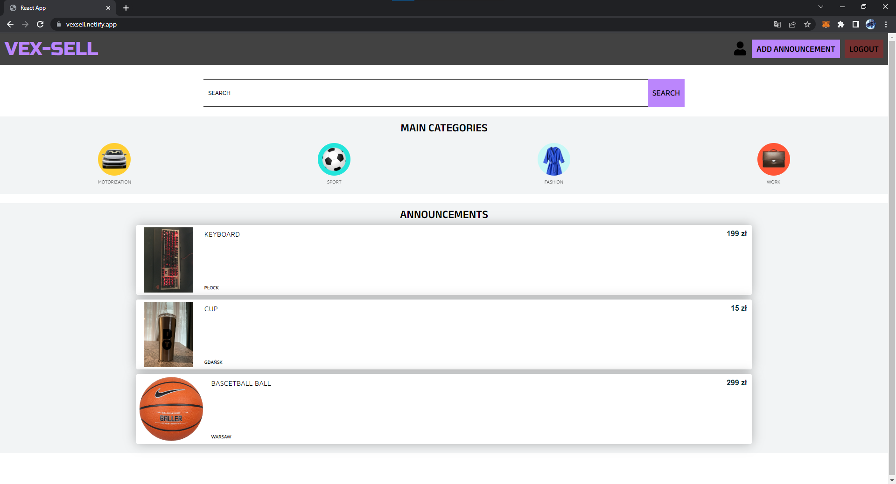
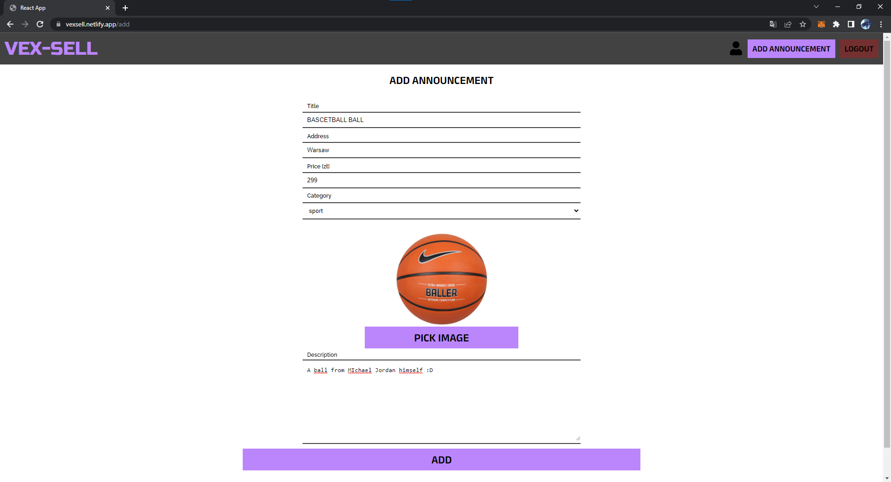
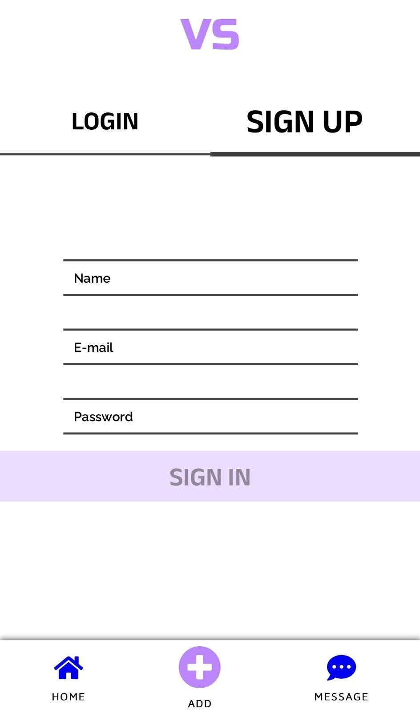
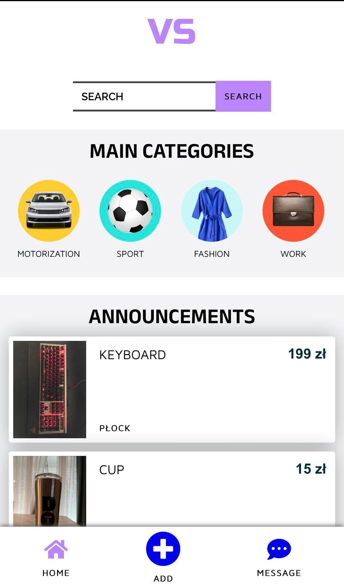

# **VEX-SELL**

## :scroll:DESCRIPTION

My first MERN application written after the course.
The application has authorization. To implement it I used libraries such as:

- bcryptjs - for password security on the database side [MongoDB]

- jsonwebtoken - to generate a login token  

## :camera:SCREENSHOTS

### Desktop




### Mobile




## :checkered_flag:GETTING STARTED

Run the following commands in order to have the code up and running on your machine:

``` bash
# installs dependencies
$ npm install
# run app
$ npm start
```

### Compiles and minifies for production

```
npm run build
```

### Lints and fixes files

```
npm run lint
```

### Customize configuration

See [Configuration Reference](https://cli.vuejs.org/config/)


